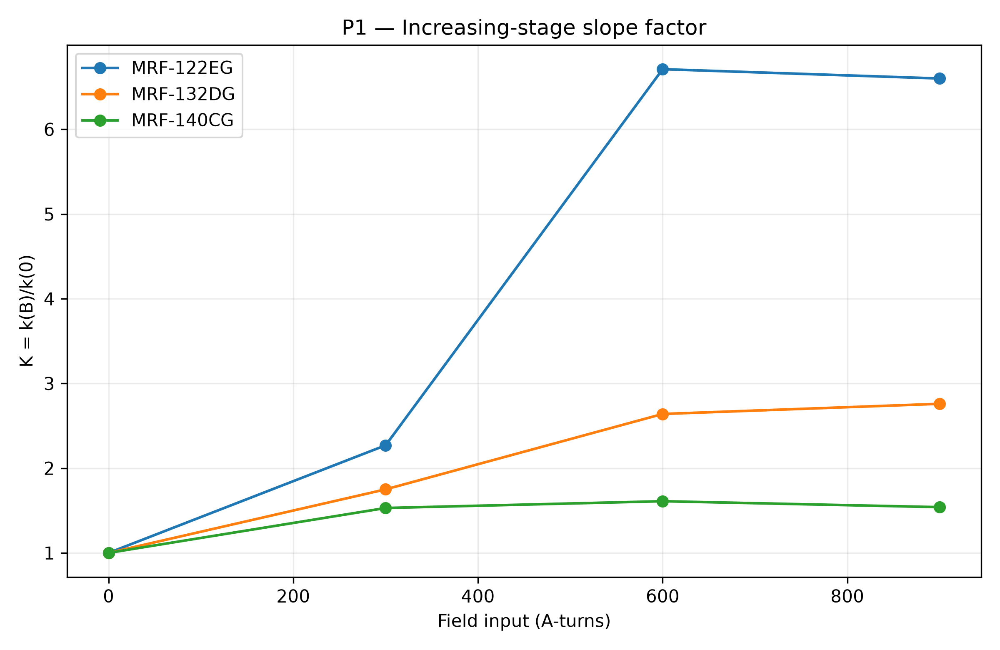
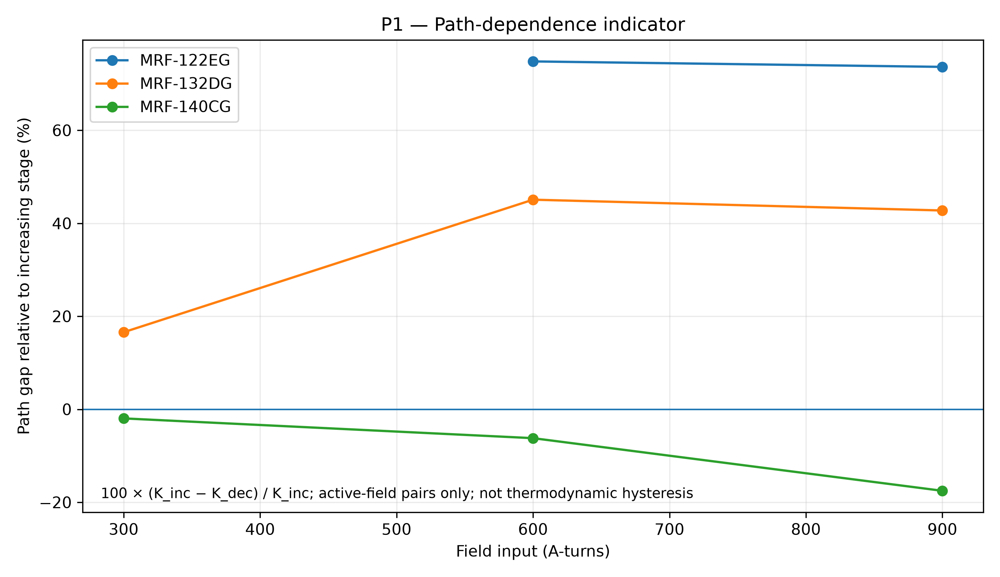
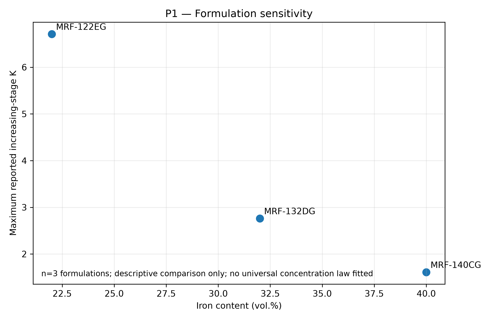
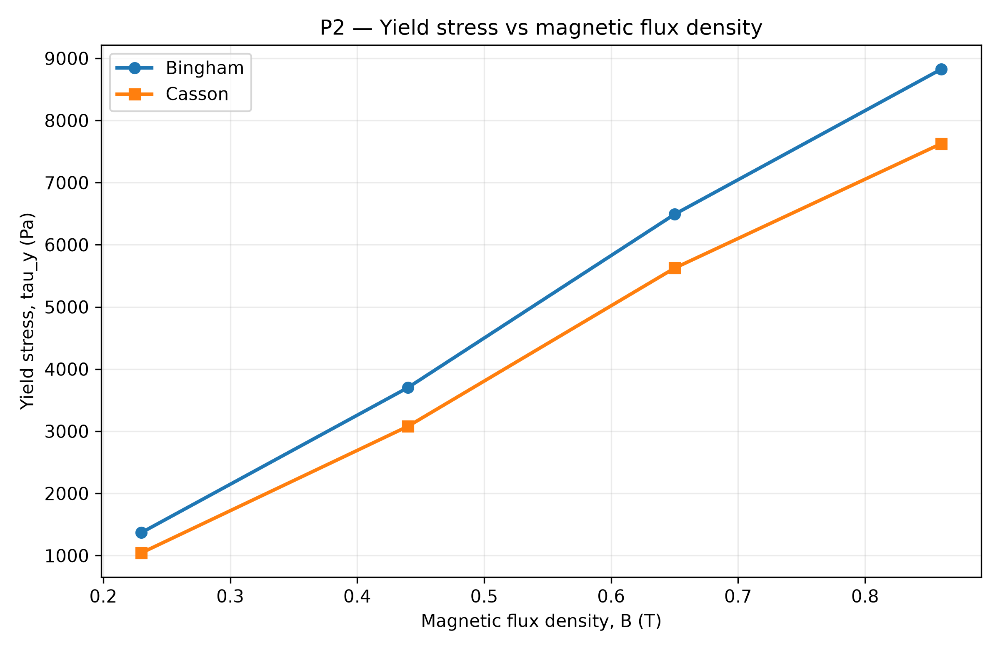
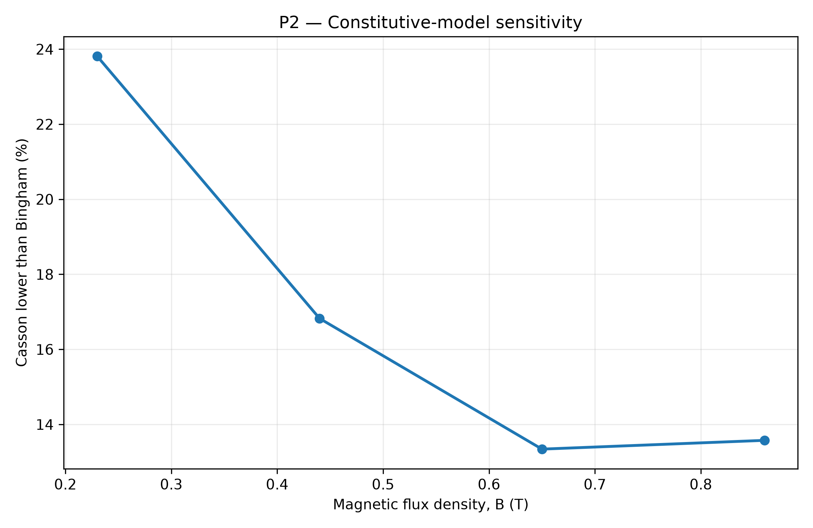
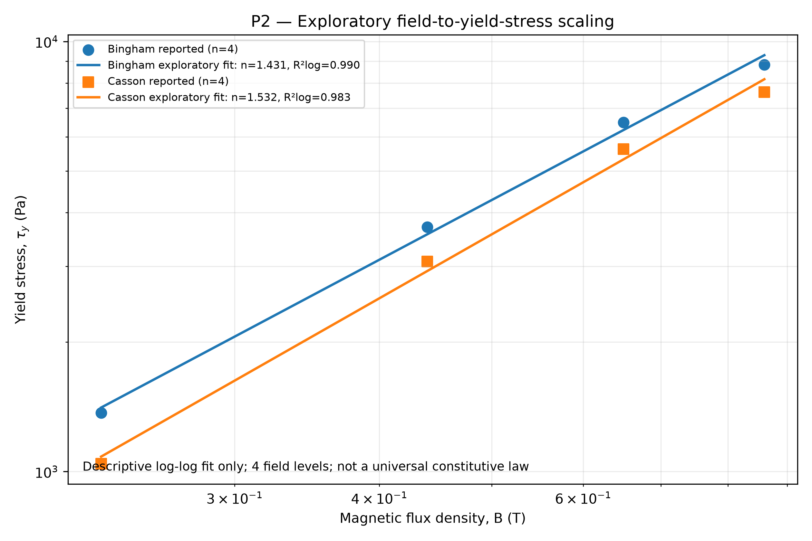
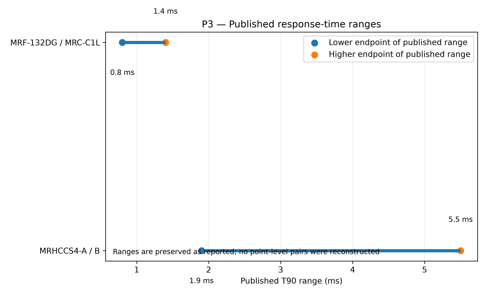
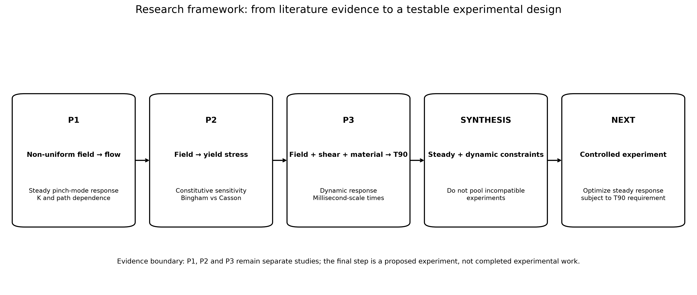

# Magnetorheological Fluid Response Under Magnetic Excitation
## A Third-Year MITACS GRI-Level Literature-Driven Quantitative Research Project

**Author:** Forum Tailor  
**Program:** B.Tech Robotics & Automation, Zeal College of Engineering and Research  
**Project type:** Reproducible computational/literature-based research  
**Status:** Final audited version — intended to be frozen after GitHub publication

---

## Abstract

Magnetorheological (MR) fluids are field-responsive suspensions whose mechanical behaviour changes rapidly when exposed to magnetic excitation. This project investigates three coupled aspects of MR-fluid performance using three complementary experimental studies: (1) non-uniform-field pinch-mode flow behaviour, (2) steady-state rheological constitutive modelling, and (3) millisecond-scale transient rheological response.

A provenance-controlled dataset of **43 source-derived records** was constructed from the published papers. No experimental values were invented, reconstructed from plots when unavailable, or pooled across incompatible apparatuses. Python was used to perform quantitative secondary analysis of constitutive-model sensitivity, exploratory field-to-yield-stress scaling, pinch-mode loading-path dependence, formulation sensitivity, field-response increments, and transient-response constraints.

The central finding is that MR-fluid design is a **multi-variable optimization problem rather than a maximum-field problem**. In P1, the lower-iron formulation reaches a maximum reported increasing-stage slope factor of **K = 6.71**, while the 40 vol.% formulation reaches **K = 1.61**. The increasing/decreasing sweep difference is strongly formulation-dependent. In P2, Casson yield-stress estimates are **13.3–23.8% lower** than the corresponding Bingham estimates. In P3, rheological response is on the millisecond scale and depends on shear rate, magnetization and carrier-fluid viscosity; the paper reports the generalized relation **T* = 4.1939 Mn^-0.35**.

The project's research contribution is not new experimental data. It is an auditable computational synthesis that converts heterogeneous published measurements into a reproducible quantitative framework and proposes a controlled next-stage experiment capable of testing the identified mechanisms.

---

# 1. Research Question

### Central question

**How do magnetic excitation, MR-fluid formulation, loading history and transient rheology interact to determine the useful steady and dynamic response of an MR-fluid device?**

### Sub-questions

1. How strongly does magnetic excitation change the inferred yield stress?
2. How sensitive are engineering conclusions to the selected constitutive model?
3. How does MR-fluid formulation affect non-uniform-field pinch-mode response?
4. Does loading path change the measured pinch-mode response?
5. What controls the rheological response time after a rapid magnetic-field change?
6. What experiment should be performed next to separate these effects under controlled conditions?

---

# 2. Research Hypotheses

**H1 — Field-strength hypothesis:** Increasing magnetic excitation increases the measured MR-fluid yield stress under controlled rheological conditions.

**H2 — Model-sensitivity hypothesis:** Bingham and Casson models can both fit the same rheological observations well while producing materially different yield-stress estimates.

**H3 — Formulation/path hypothesis:** Pinch-mode slope amplification depends strongly on particle concentration and on whether the flow velocity is increasing or decreasing.

**H4 — Dynamic-response hypothesis:** Rheological response time is not a single fixed material constant; it varies with shear rate, magnetization and carrier-fluid viscosity.

---

# 3. Source Papers

### P1 — Non-uniform magnetic field / pinch mode

Kubík, M., Gołdasz, J., Macháček, O., Strecker, Z., & Sapiński, B. (2023). **Magnetorheological fluids subjected to non-uniform magnetic fields: experimental characterization.** *Smart Materials and Structures*, 32, 035007. DOI: 10.1088/1361-665X/acb473.

### P2 — Steady-state rheology / constitutive models

Xie, J., Liu, C., & Cai, D. (2020). **Analysis and Experimental Study on Rheological Performances of Magnetorheological Fluids.** *Mechanika*, 26(1), 31–34. DOI: 10.5755/j01.mech.26.1.25244.

### P3 — Transient response

Kubík, M., Válek, J., Žáček, J., Jeniš, F., Borin, D., Strecker, Z., & Mazůrek, I. (2022). **Transient response of magnetorheological fluid on rapid change of magnetic field in shear mode.** *Scientific Reports*, 12, 10612. DOI: 10.1038/s41598-022-14718-5.

Official full-text locations are recorded in `references/SOURCE_PAPERS.md`.

---

# 4. Why These Three Papers Were Combined

The papers are **not treated as one pooled experiment**. They operate at different levels:

| Layer | Paper | Main response |
|---|---|---|
| P1 | Non-uniform-field pinch mode | Pressure-flow slope and offset |
| P2 | Uniform-field shear rheology | Yield stress and model parameters |
| P3 | Rapid magnetic-field switching | Rheological response time |

The research framework is therefore:

**magnetic excitation → material structuring → steady response → flow-path effects → transient response → device/control requirement**

This preserves physical meaning while still allowing a research-level synthesis.

---

# 5. Data Provenance and Reproducibility

The project contains **43 source-derived master records**:

- P1: 27 records
- P2: 8 records
- P3: 8 records

Every source-derived observation retains:

- paper identifier;
- source table/figure/location;
- sample identity;
- condition;
- measured quantity;
- units;
- source-status label.

All derived calculations are stored separately under `results/`.

### Critical scientific rule

**A missing published value remains missing.**

For example, P1 does not provide a usable value for MRF-122EG at 300 A during the velocity-decrease stage. That cell remains blank. No interpolation or invented value is used.

---

# 6. P1 — Non-Uniform-Field Pinch-Mode Analysis

## 6.1 Experimental context

P1 investigates a pinch-mode MR valve in which the magnetic field is intentionally non-uniform and preferentially energizes fluid near the channel walls. The prototype used a 3 mm through-hole and a 30 mm channel length. The usable operating range of the solenoid was identified as 0–900 ampere-turns.

Three formulations were tested:

| Fluid | Fe concentration | Base viscosity at 30 °C |
|---|---:|---:|
| MRF-122EG | 22 vol.% | 56 cP |
| MRF-132DG | 32 vol.% | 156 cP |
| MRF-140CG | 40 vol.% | 648 cP |

The flow excitation was approximately 0–0.96 L/min, and pressure-flow characteristics were obtained during increasing and decreasing velocity stages.

## 6.2 Slope factor

P1 defines:

`K = k(B) / k(0)`

where `k(B)` is the pressure-flow slope at the magnetic excitation condition and `k(0)` is the zero-field slope.

## 6.3 Important audit correction: the maximum K is 6.71, not 6.60

The published Table 2 contains:

- 900 A: K = 6.60
- 600 A: K = **6.71**
- 300 A: K = 2.27
- 0 A: K = 1.00

Therefore, the **maximum tabulated increasing-stage K is 6.71 at 600 A**, not 6.60 at 900 A.

The paper's prose highlights K = 6.6 at 900 A, but the table itself reports the larger value at 600 A. This project uses the **table value for quantitative analysis** and explicitly preserves the discrepancy rather than silently choosing one.

## 6.4 Formulation sensitivity

Maximum reported increasing-stage K values are:

| Fluid | Fe vol.% | Maximum increasing-stage K |
|---|---:|---:|
| MRF-122EG | 22 | **6.71** |
| MRF-132DG | 32 | **2.76** |
| MRF-140CG | 40 | **1.61** |

From 22 to 40 vol.% Fe, the maximum K decreases by approximately **76.0%**.

The base viscosity simultaneously increases from 56 cP to 648 cP, approximately **11.6×**.

This is a strong formulation-sensitivity observation, but **n = 3 formulations is not enough to establish a universal concentration law**.

## 6.5 Loading-path analysis

For each formulation and active field where both stages are reported, the project calculates:

`Path gap (%) = 100 × (K_increasing − K_decreasing) / K_increasing`

For the active-field matched observations:

| Fluid | Mean path gap | Interpretation |
|---|---:|---|
| MRF-122EG | +74.2% | Decreasing-stage K is much smaller |
| MRF-132DG | +34.8% | Strong but smaller path difference |
| MRF-140CG | −8.6% | Decreasing-stage K is slightly larger |

The 0-A points are excluded from this interpretation because they are the baseline rather than an activated path-history comparison.

The missing MRF-122EG 300-A decreasing-stage point is also excluded automatically.

## 6.6 Physical interpretation

P1 proposes that magnetic-field-gradient forces drive particle migration toward high-flux regions. During the increasing-velocity stage, particles have more opportunity to accumulate in the active zone, changing local concentration and permeability. During the decreasing stage, particles may be washed out before they can redistribute into the active region.

At high particle concentration, the active region approaches a packing limit, so additional concentration increase produces much less slope amplification.

This interpretation is consistent with the observed formulation and path dependence, but it remains a mechanism proposed by the source study rather than a mechanism independently proven by this project.







## 6.7 Repeatability limitation

P1 reports pressure pulsations and notes that the repeatability for MRF-122EG at 900 A is imperfect; a pressure drop of 0.54 bar was observed in one run. The paper also reports a measurable magnetic-flux variation associated with these events.

This is important: the project does **not** treat every P1 point as noise-free deterministic truth.

---

# 7. P2 — Constitutive-Model Analysis

## 7.1 Source data

P2 tested a silicone-based MRF containing 10 vol.% carbonyl iron powder and fitted Bingham and Casson models at four magnetic flux densities.

### Reported yield-stress values

| B (T) | Bingham τy (Pa) | Casson τy (Pa) | Casson lower than Bingham |
|---:|---:|---:|---:|
| 0.23 | 1369 | 1043 | 23.81% |
| 0.44 | 3703 | 3080 | 16.82% |
| 0.65 | 6491 | 5625 | 13.34% |
| 0.86 | 8825 | 7627 | 13.58% |

## 7.2 Field effect

Bingham yield stress rises from 1369 Pa to 8825 Pa as B increases from 0.23 T to 0.86 T — a **6.45× increase**.

Casson yield stress rises from 1043 Pa to 7627 Pa — a **7.31× increase**.

Therefore H1 is supported within the tested range; the evidence is limited to four field levels from one source study.

## 7.3 Constitutive-model sensitivity

The Casson estimate is 13.3–23.8% lower than the corresponding Bingham estimate.

This is not merely a cosmetic difference. If yield stress is used in a device-sizing calculation, switching constitutive model can change the inferred threshold by a meaningful percentage.

The difference is largest at the lowest tested field (23.8%) and settles near 13–14% at the higher fields.





## 7.4 Fit quality

The published R² values are high for both model families, approximately 0.976–0.997. Thus, **good fit quality does not imply identical physical parameter estimates**.

This is an important research lesson: model selection must consider parameter meaning, not only goodness-of-fit.

## 7.5 Exploratory field-to-yield-stress scaling

A log-log power-law fit was calculated only as a descriptive sensitivity analysis:

`tau_y = a B^n`

Results:

| Model | a | n | Log-scale R² | Leave-one-out n SD |
|---|---:|---:|---:|---:|
| Bingham | 11531.83 | 1.431 | 0.990 | 0.082 |
| Casson | 10295.43 | 1.532 | 0.983 | 0.109 |

The exponent remains of order 1.4–1.5 under leave-one-out analysis, but the sample contains only **four field levels**. Therefore this is an **exploratory scaling relation, not a universal MR-fluid constitutive law**.



## 7.6 Source discrepancy handled explicitly

The P2 prose states a final Casson value of approximately 7624 Pa in one sentence, while Table 4 reports **7627 Pa**. The project uses the table value, 7627 Pa, because the table is the structured source data used for the quantitative comparison. The discrepancy is documented rather than hidden.

---

# 8. P3 — Transient Rheological Response

## 8.1 Experimental context

P3 studies the response of MR fluids to a rapid magnetic-field change in shear mode. The custom rheometer uses a 0.6 mm gap, high-speed acquisition, and a rapid current-control system.

The paper distinguishes:

1. magnetic/electrical excitation response;
2. particle-structure development;
3. rheological response.

The study uses T63 as the first-order time constant and T90 as the 0–90% rise time.

## 8.2 Hardware response

The magnetic/electrical excitation response is approximately:

- T63I = 0.21 ms;
- T90I = 0.335 ms at 1 A;
- T90I = 0.365 ms at 2 A.

The shear-stress response additionally exhibits an initial dead time of approximately **0.4 ms**.

This distinction matters: the device cannot be treated as having zero excitation delay.

## 8.3 Shear-rate dependence

For MRHCCS4-A and MRHCCS4-B, the paper reports T90 decreasing from approximately **5.5 ms to 1.9 ms** over shear rates from **11 to 218 s⁻¹**.

The project does not reconstruct individual point pairs because the complete numerical pairs are not provided in the accessible text. Instead, the published range is preserved exactly.

For MRF-132DG and MRC-C1L, the reported T90 range is approximately **1.4–0.8 ms**.

## 8.4 Carrier-fluid viscosity

P3 explicitly reports that higher carrier-fluid viscosity increases response time. For two fluids with similar particle concentration, the carrier-fluid viscosity contrast is approximately 2.8×, and the higher-viscosity fluid exhibits significantly higher response time.

Because the complete point-level T90 pairs are not published in the accessible text, this project does not fit a false numerical viscosity-response law.

## 8.5 Magnetization

P3 reports that higher MR-fluid magnetization reduces T90. This is interpreted as a dynamic structuring effect rather than simply a larger steady-state yield stress.

## 8.6 Dimensionless master curve

P3 defines:

`T* = T90 / [144 eta / (M^2 mu0)]`

and

`Mn = 144 eta gamma_dot / (M^2 mu0)`

and reports the generalized master curve:

`T* = 4.1939 Mn^-0.35`

The project records this as a **source-reported fitted relation** rather than claiming to have independently refitted it.

P3 also reports a deviation from a previous model for Mason numbers above approximately 0.005 and discusses possible effects of model simplification, additives and surface roughness.



---

# 9. Cross-Paper Quantitative Synthesis

The three studies reveal three distinct control layers.

### Layer 1 — Steady strength

P2 shows that magnetic excitation can strongly increase yield stress.

### Layer 2 — Flow-path and formulation behaviour

P1 shows that the useful pinch-mode slope response is highly dependent on formulation and loading history.

### Layer 3 — Dynamic response

P3 shows that the time required for the rheological state to develop is influenced by shear rate, magnetization and carrier-fluid viscosity.

Therefore:

> **The best MR-fluid operating condition is not necessarily the condition with the maximum magnetic field. It is the condition that meets the required steady response while minimizing unnecessary excitation and maintaining acceptable transient behaviour.**

This is the engineering synthesis of the three studies.

---

# 10. Proposed Research Gap

The three papers individually study important variables, but no single experiment in this project simultaneously controls:

- particle concentration;
- carrier-fluid viscosity;
- magnetic excitation;
- shear/flow rate;
- loading direction/history;
- temperature;
- transient response.

This creates a research opportunity: develop a controlled experimental response surface that predicts both **steady performance** and **dynamic response** for a defined MR-fluid formulation.

---

# 11. Proposed Next-Stage Experiment

## 11.1 Experimental objective

Determine the minimum magnetic excitation required to meet a target steady-state pressure/yield response while keeping T90 below a specified dynamic limit.

## 11.2 Independent variables

A practical factorial design should include:

1. magnetic flux density;
2. shear rate / flow rate;
3. particle concentration;
4. carrier-fluid viscosity;
5. temperature;
6. increasing vs decreasing loading path.

## 11.3 Responses

- yield stress τy;
- Bingham/Casson/Herschel–Bulkley model parameters;
- pressure-flow slope k;
- normalized K;
- pressure offset;
- T63;
- T90;
- excitation rise time;
- repeatability / coefficient of variation.

## 11.4 Controls

- calibrated pressure/torque sensors;
- fixed geometry;
- controlled temperature;
- controlled magnetic waveform;
- fixed sample preparation protocol;
- preconditioning cycle;
- repeated measurements;
- randomized test order where practical;
- uncertainty reporting;
- independent validation runs.

## 11.5 Recommended experimental structure

A staged design is preferable to an unnecessarily huge full-factorial experiment:

**Stage A:** characterize 3–4 formulations at zero field.  
**Stage B:** obtain steady-state flow curves across a controlled field range.  
**Stage C:** fit competing constitutive models and compare residuals + parameter stability.  
**Stage D:** perform increasing/decreasing path tests.  
**Stage E:** perform rapid field-step tests at selected shear rates.  
**Stage F:** fit a response surface and validate it on withheld conditions.

The final validation set must not be used to tune the model.

---

# 12. Statistical and Scientific Discipline

This project intentionally avoids several common undergraduate research errors:

- treating three formulations as sufficient for a universal concentration law;
- treating a plotted range as a complete numerical dataset;
- mixing different apparatuses into one regression without justification;
- interpreting a constitutive fit's R² as proof that the model is physically superior;
- filling missing values by guesswork;
- calling path dependence thermodynamic hysteresis;
- presenting literature measurements as newly measured data.

The project therefore separates:

**source data → derived calculations → interpretation → proposed future experiment**.

---

# 13. Limitations

1. No new laboratory measurements were performed.
2. P1, P2 and P3 use different fluids, geometries, operating modes and measurement systems.
3. P2 contains only four field levels.
4. P1 contains only three formulations.
5. P3 does not provide every response-time point numerically in the accessible article text.
6. Some source conclusions depend on mechanisms inferred by the original authors.
7. The project therefore does not claim a universal MR-fluid constitutive law or universal response-time law.

These limitations are not weaknesses to hide; they define the boundary of what the evidence can legitimately support.

---

# 14. Reproducibility

From the project root:

```bash
python src/MR_Fluid_quantitative_analysis.py
```

The script:

- validates source-record counts;
- verifies the known missing P1 observation remains missing;
- regenerates all derived CSV files;
- regenerates all figures;
- performs the P2 power-law sensitivity analysis;
- calculates P1 path-dependence metrics;
- calculates P1 formulation sensitivity;
- preserves P3 response ranges without inventing point data.

The generated tables in `results/` and figures in `figures/` are reproducible from the source-derived CSV data.

---

# 15. Research Contribution

The contribution of this project is a **reproducible quantitative research workflow** rather than a claim of experimental novelty.

The project demonstrates:

- research-question formulation;
- primary-literature reading;
- source-data extraction;
- data provenance;
- Python analysis;
- constitutive-model comparison;
- dimensional and dimensionless reasoning;
- sensitivity analysis;
- missing-data discipline;
- cross-study synthesis;
- experimental-design planning;
- reproducibility and auditability.

These are the competencies expected from a strong third-year student preparing for research-intensive opportunities such as MITACS GRI.

---

# 16. Final Scientific Conclusion

The combined evidence supports a clear conclusion:

**MR-fluid performance cannot be optimized by magnetic field strength alone.**

Magnetic excitation strongly affects steady yield response, but the useful device response is additionally controlled by formulation, flow history and dynamic rheology. The P1 results show that particle concentration can strongly suppress pinch-mode slope amplification and reduce path sensitivity. P2 shows that constitutive-model selection changes the inferred yield stress even when both models fit well. P3 shows that dynamic response is measurable on the millisecond scale and varies with shear rate, magnetization and carrier-fluid viscosity.

The strongest next research step is therefore a controlled experiment that simultaneously measures **steady response, path dependence and transient response** for a known MR-fluid formulation under controlled temperature and magnetic excitation.



That experiment would move this work from a strong literature-based computational project into genuine original experimental research.

---

# 17. Final Project Classification

**Classification:** Third-year research-level computational/literature project.  
**Research maturity target:** MITACS GRI-level benchmark for an undergraduate portfolio.  
**Original experimental data:** No.  
**Original quantitative secondary analysis:** Yes.  
**Reproducible code:** Yes.  
**Source provenance:** Yes.  
**Publication claim:** Do not claim that the literature measurements are original. If converted into a publication, the manuscript must clearly identify this work as a secondary quantitative synthesis unless original experiments are subsequently performed.

